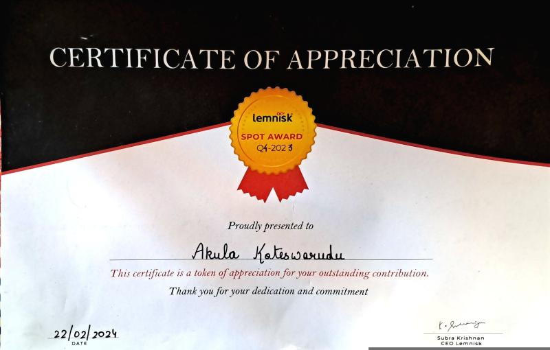

  

  

  
  <h1 style="color: white; margin: 0; font-size: 2.5rem; text-shadow: 2px 2px 4px rgba(0,0,0,0.3);">
    🚀 The Full-Time Evolution
  </h1>
  

    July 2023 - Present • Sections 6-10 from the original journey
  

  

  

    

      6
    

    <h2 style="color: white; margin-top: 0; font-size: 1.8rem;">🏦 Transition to Full-Time: Entering the Banking Client Universe</h2>
    
    

      

        When my internship ended and I transitioned to a full-time SDE role, I thought I understood what I was getting into. I was wrong. The banking client stack was a completely different beast – simpler in some ways, but carrying the weight of being one of our most critical clients. This was a bank's critical infrastructure, and there was no room for error.
      

    

    

      

        The banking client's world revolved around two fundamental flows: promotional campaigns that arrived as batch files via SFTP, and real-time transactional notifications that came through socket connections. Each flow had its own personality, its own challenges, and its own requirements for reliability and security.
      

    

    

      

        

          
📁

          <strong style="color: white; display: block;">Promotional Flow</strong>
        

        

          The promotional flow felt like watching a well-orchestrated machine. Files would arrive on our SFTP server, get picked up by cron jobs, transferred to processing VMs where Flume applications would transform and validate the data before feeding it into Kafka. It was batch processing at scale, requiring careful attention to error handling and data integrity.
        

      

      

        

          
⚡

          <strong style="color: white; display: block;">Transactional Flow</strong>
        

        

          The transactional flow was the complete opposite – real-time, high-stakes, and demanding instant responses. Notifications would arrive through our Node.js socket applications, get authenticated, validated, and immediately pushed into Kafka topics for processing. The margin for error was essentially zero.
        

      

    

    

      <strong style="color: white;">🎯 Mission Critical:</strong> Banking infrastructure with zero tolerance for errors
    

  

  

    

      7
    

    <h2 style="color: white; margin-top: 0; font-size: 1.8rem;">🔒 The Security Challenge: Understanding Encryption</h2>
    
    

      

        Working with financial services clients meant that security couldn't be an afterthought. The transactional flow required a sophisticated two-step encryption process that I had to master completely. Every user device would generate unique RSA key pairs through our SDK, sending the public keys to our backend for storage in Aerospike. When sending notifications, we would generate a fresh AES key for each message, encrypt the notification payload with this AES key, then encrypt the AES key itself using the device's specific RSA public key.
      

    

    

      

        The system also needed to track user consent at a granular level – both promotional and transactional notifications required explicit user permission. Our SDK would capture consent from users in the client app and send it to our backend, where it was stored at the user level in Aerospike for validation during notification processing. It was an elegant and secure approach that ensured only authorized devices could decrypt and display notifications.
      

    

    

      

        
🔑

        <strong style="color: white;">RSA Encryption</strong>
      

      

        
🛡️

        <strong style="color: white;">AES Security</strong>
      

      

        
✅

        <strong style="color: white;">User Consent</strong>
      

    

    

      <strong style="color: white;">🔐 Security Architecture:</strong> Two-step encryption with device-specific RSA keys and fresh AES keys for each message
    

  

  

    

      8
    

    <h2 style="color: white; margin-top: 0; font-size: 1.8rem;">🚧 The Node.js Performance Wall</h2>
    
    

      

        As the banking client's usage grew, we started hitting the fundamental limitations of our Node.js push sender. Despite our best optimization efforts – tuning Kafka configurations, optimizing consumer handlers, and addressing rebalancing issues – we could barely push through 5,000 events per minute. For an I/O intensive application, JavaScript's single-threaded nature was becoming a bottleneck we couldn't engineer around.
      

    

    

      

        The Kafka issues were particularly frustrating. Consumer groups would constantly rebalance, disrupting our throughput and causing delivery delays. We tried everything – adjusting timeouts, tuning heartbeat intervals, optimizing our consumer code – but the problems persisted. Eventually, we discovered that the real issue was our Azure HDInsight Kafka setup. Migrating to a standalone Kafka cluster resolved the rebalancing issues, but the fundamental performance limitations remained.
      

    

    

      

        
📊

        <strong style="color: white; display: block;">Throughput Limit</strong>
        5,000 events/min
      

      

        
⚠️

        <strong style="color: white; display: block;">Bottleneck</strong>
        Single-threaded JS
      

    

    

      <strong style="color: white;">🔍 Root Cause:</strong> JavaScript's single-threaded nature became an insurmountable bottleneck for high-throughput processing
    

  

  

    

      9
    

    <h2 style="color: white; margin-top: 0; font-size: 1.8rem;">🚀 Building the Future: The Java Push Sender Revolution</h2>
    
    

      

        Faced with these limitations, our team made a bold decision – we would rewrite the entire push sender from scratch in Java Spring Boot. This wasn't just about changing languages; it was about reimagining how a high-performance notification system should work.
      

    

    

      

        I took on this challenge with enthusiasm, using AI tools like Windsurf not as a crutch, but as a collaboration partner. I would design the architecture, write the code, and then use AI to review and suggest improvements. Every suggestion was carefully evaluated, modified to match my coding style, and integrated only if it truly improved the solution.
      

    

    

      

        The architecture I built was something I'm genuinely proud of. Using SOLID principles and carefully chosen design patterns, I created a system of abstractions and interfaces that could handle not just the banking client's specific requirements, but also the varied payload types from our main Marketing Automation flow used by all other clients. The results were staggering – on the exact same hardware that struggled with 5,000 events per minute in Node.js, our Java application processed 150,000 events per minute. We rolled it out across all regions and all clients, replacing years of accumulated technical debt with a single, unified solution.
      

    

    

      

        
📈

        <strong style="color: white; display: block;">Before</strong>
        5,000 events/min
      

      

        
🚀

        <strong style="color: white; display: block;">After</strong>
        150,000 events/min
      

    

    

      <strong style="color: white;">🎯 Revolutionary Result:</strong> 30x performance improvement on the same hardware - replaced years of technical debt with a unified solution
    

  

  

    

      10
    

    <h2 style="color: white; margin-top: 0; font-size: 1.8rem;">🎨 The Art of Performance Optimization</h2>
    
    

      

        One of the most satisfying moments of my career came from what seemed like a trivial change. While performance testing our Android notification flow with Lambda batching, I noticed we were hitting a throughput ceiling around 33,000 events per minute. Something was creating a bottleneck, but it wasn't obvious what.
      

    

    

      

        Diving into the code, I found the culprit in our batching logic. Every time we added a payload to a batch, we were converting the entire JSON array to a string and calculating its byte length. For a batch of 50 items, this meant the first addition took microseconds, but by the 49th addition, we were spending nearly 3 milliseconds just calculating sizes.
      

    

    

      

        The fix was embarrassingly simple – instead of recalculating the entire batch size each time, just add the new payload's size to a running total. One line of code changed, and our throughput improved dramatically. It was a perfect reminder that performance optimization is often about understanding exactly what your code is doing, not just making it more complex.
      

    

    

      

        
🔍

        <strong style="color: white; display: block;">Problem</strong>
        Inefficient batching
      

      

        
⚡

        <strong style="color: white; display: block;">Solution</strong>
        One line fix
      

    

    

      <strong style="color: white;">💡 Key Insight:</strong> Performance optimization is about understanding exactly what your code is doing, not making it more complex
    

  

## 🏆 Recognition & Impact

  

    

      <h3 style="color: white; margin-top: 0;">🏆 Lemnisk Spot Award Q1 2024</h3>
      

        Received recognition for <strong>outstanding contribution and dedication</strong> during my full-time journey. This award reflects the impact of performance optimizations, system architecture improvements, and technical leadership contributions.
      

    

    

      
    

  

## 🎯 Full-Time Journey Impact

  <h3 style="color: white; margin-top: 0;">Transforming from Intern to System Architect</h3>
  

    

      <h4 style="color: #e67e22; margin-bottom: 0.5rem;">🏛️ Enterprise Ready</h4>
      
Successfully transitioned to working with banking clients, understanding enterprise-grade security and compliance requirements.

    

    

      <h4 style="color: #8e44ad; margin-bottom: 0.5rem;">🏗️ System Architect</h4>
      
Led the complete architectural overhaul from Node.js to Java Spring Boot, achieving 30x performance improvement.

    

  

---

  <h3 style="color: #2c3e50; margin-bottom: 1rem;">Explore More of the Journey</h3>
  
Discover the technical innovations and problem-solving achievements

  
  

    <a href="../index.html" style="background: #34495e; color: white; padding: 1rem 2rem; border-radius: 8px; text-decoration: none; font-weight: bold;">
      ← Back to Home
    </a>
    <a href="lemnisk_overview.html" style="background: #95a5a6; color: white; padding: 1rem 2rem; border-radius: 8px; text-decoration: none; font-weight: bold;">
      Back to Overview
    </a>
    <a href="lemnisk_technical.html" style="background: #e74c3c; color: white; padding: 1rem 2rem; border-radius: 8px; text-decoration: none; font-weight: bold;">
      Technical Innovations and Problem-Solving →
    </a>
  

